<div align="center">

# 🎵 Music Playlist — Mood-Based Music Recommendation

**DSL 24-1 Modeling Project**

*Tell us how you feel, in your own words — get a playlist that matches the mood.*

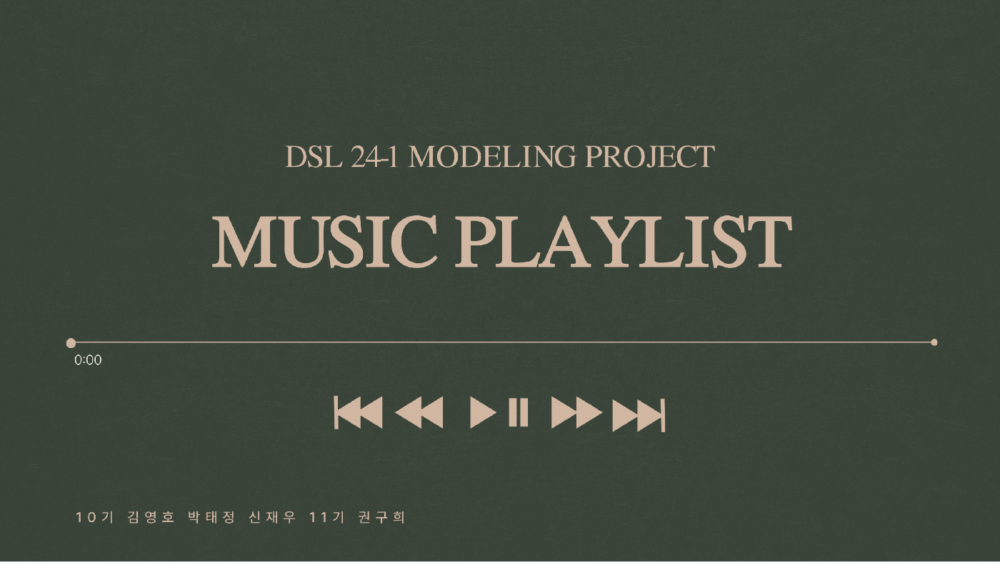

[](https://pytorch.org/)
[](https://huggingface.co/bert-base-uncased)
[](https://openai.com/research/jukebox)
[](https://deepmind.google/technologies/gemini/)

</div>

---

## 📖 Table of Contents

1. [Overview](#-overview)
2. [Try It Now (no weights needed)](#-try-it-now-no-weights-needed)
3. [Motivation](#-motivation)
4. [How It Works — The Pipeline](#-how-it-works--the-pipeline)
5. [Dataset](#-dataset)
6. [Task 1 — Text → Mood (BERT)](#-task-1--text--mood-bert)
7. [Task 2 — Song → Mood (Gemini labeling)](#-task-2--song--mood-gemini-labeling)
8. [Task 3 — Audio → Representation (JukeMIR)](#-task-3--audio--representation-jukemir)
9. [Putting It Together — Recommendation](#-putting-it-together--recommendation)
10. [Results](#-results)
11. [Repository Structure](#-repository-structure)
12. [Getting Started](#-getting-started)
13. [Large Files (weights & data)](#-large-files-weights--data)
14. [Limitations & Future Work](#-limitations--future-work)
15. [Tech Stack](#-tech-stack)
16. [Team](#-team)

---

## 🎯 Overview

**Music Playlist** is a recommendation system that builds a playlist from a free-text description of
*how you feel* or *what you're doing*. Instead of asking you to pick a genre, you type something like

> *"When you got rejected by a girl"* or *"I need to get motivated to exercise"*

and the system returns songs whose **mood** matches your situation.

The core idea: **a song's tempo and register define its genre, and its genre is essentially its *mood*.**
So if we can (a) read the mood out of a user's text and (b) know the mood of every song, then a simple
**similarity match** between the two gives us a mood-aligned playlist.

The project is built around three machine-learning tasks that solve the two halves of that match:

| | Task | Input → Output | Model |
|---|---|---|---|
| **1** | Read the user's mood | free text → mood vector | **BERT** (fine-tuned, multi-label) |
| **2** | Label each song's mood | song description → mood vector | **Gemini** (LLM annotation) |
| **3** | Understand the audio itself | raw audio → representation → mood vector | **JukeMIR** (OpenAI Jukebox + probe) |

> 📑 This repository is a **documentation- and replication-focused** writeup of the project — code,
> notebooks, the small datasets, and instructions, but **no trained model weights or raw audio**
> (you reproduce those by running the pipeline). It is based on the presentation
> [`presentation/DSL_Recsys.pdf`](presentation/DSL_Recsys.pdf), the original source of the work.
> A rendered web version of this page lives in [`docs/`](docs/) (GitHub Pages).

<div align="center">

</div>

---

## ⚡ Try It Now (no weights needed)

The system's **final step** — mood vector → cosine similarity → Top-K playlist — runs on the **real
song database** with one command. No model weights, no GPU, no audio; just `pandas` + `numpy`:

```bash
pip install pandas numpy
python scripts/recommend_demo.py
#   or your own situation:
python scripts/recommend_demo.py -q "rainy day study session" -k 5
```

```text
🎧  "When you want to go to sleep"
    detected mood: Relaxed, Peaceful, Dreamy
    --------------------------------------------------------
    1. Slow Motion (Album Version) — Karina   (sim 0.87)
    2. Ditto — NewJeans                       (sim 0.82)
    3. New Jeans — NewJeans                    (sim 0.82)
    ...
```

[`scripts/recommend_demo.py`](scripts/recommend_demo.py) loads the **1,142 mood-labeled songs** from
[`data/mood_labels/song_mood_15features.csv`](data/mood_labels/song_mood_15features.csv), turns your
text into a 15-d mood vector, and ranks songs by **cosine similarity** — exactly the system's final
step. The *only* mock is text→mood (the real project uses fine-tuned BERT — see
[notebook 05](notebooks/05_bert_text_to_mood.ipynb)); the ranking logic is the real thing.

---

## 💡 Motivation

People increasingly listen to **playlists** — many songs bundled under a single *vibe* — rather than
hunting for individual tracks. Think of the YouTube "운전하다 들으면 좋은 플레이리스트" or a friend telling you
*"put on an IU playlist, you'll fall asleep."* The unit of consumption has become the **mood**, not the song.

So we asked:

> **Can we build a playlist directly from the situational *"Mood"* a user is in?**

Our working assumption is that **tempo + register → genre → mood**, and that mood is something we can
both *infer from text* and *measure from audio*. That assumption is what the three tasks below operationalize.

---

## 🔧 How It Works — The Pipeline

<div align="center">
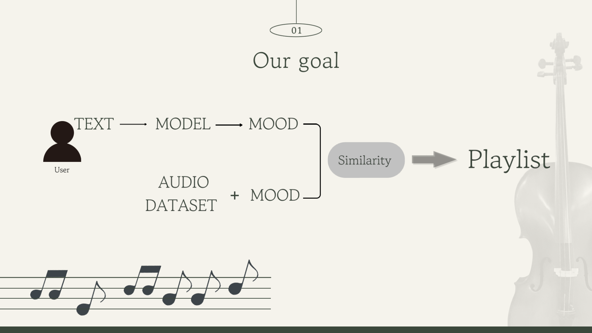
</div>

```
                 ┌─────────────────────────────────────────────┐
 User types  ──► │ TEXT ──(BERT, Task 1)──►  MOOD vector        │
 a situation     └─────────────────────────────────────────────┘
                                                   │
                                                   ▼
                                            ┌──────────────┐
                                            │  SIMILARITY  │ ──► Top-K songs (playlist)
                                            └──────────────┘
                                                   ▲
                 ┌─────────────────────────────────────────────┐
 Song library ─► │ AUDIO ──(JukeMIR, Task 3)──► representation  │
                 │ DESCRIPTION ─(Gemini, Task 2)─► MOOD vector  │
                 └─────────────────────────────────────────────┘
```

Both sides of the system speak the same language — a **mood vector** over 15 mood labels:

```
Happy · Sad · Energized · Relaxed · Nostalgic · Romantic · Angry · Focused
Inspired · Melancholic · Peaceful · Anxious · Confident · Dreamy · Lonely
```

<div align="center">
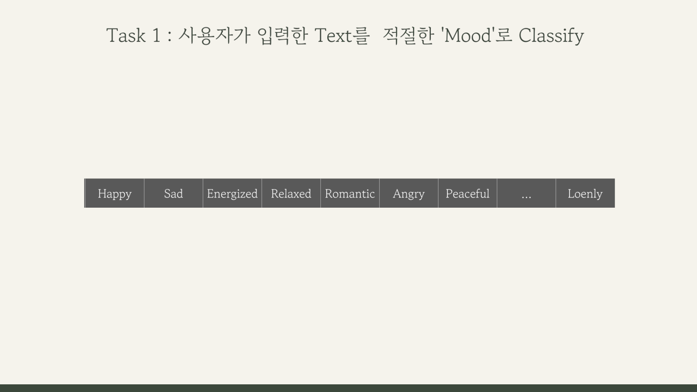
</div>

---

## 📂 Dataset

### Audio data — 2,075 songs across 12 genres

<div align="center">
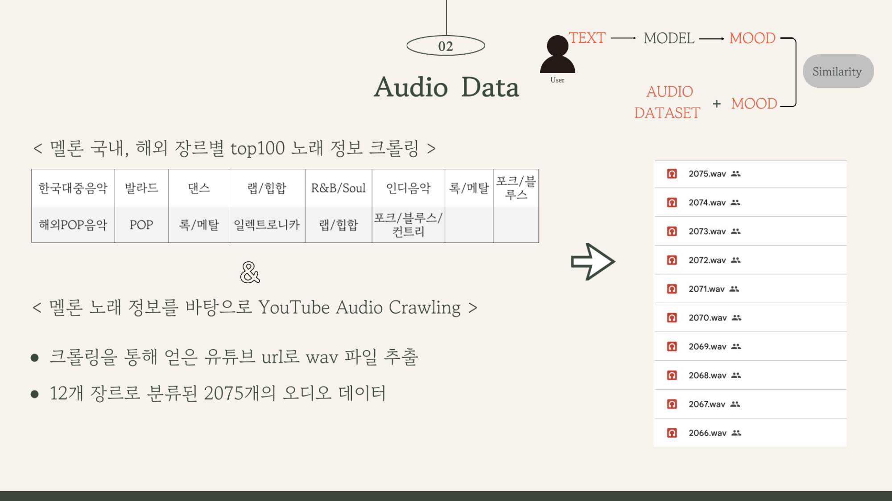
</div>

We crawled **Melon's domestic & international genre Top-100 charts** across 12 genres (Korean pop,
ballad, dance, hip-hop, R&B/soul, indie, rock/metal, folk/blues/country, overseas pop, electronica, …),
then used those song titles + artists to **search YouTube and download the audio as `.wav`** files.

| Step | Notebook | Output |
|---|---|---|
| Aggregate per-genre Top-100 lists | [`notebooks/01_genre_aggregation.ipynb`](notebooks/01_genre_aggregation.ipynb) | `metadata.csv` |
| Find a YouTube URL per song (Selenium) | [`notebooks/02_youtube_url_crawling.ipynb`](notebooks/02_youtube_url_crawling.ipynb) | `metadata_url.csv` |
| Download audio as `.wav` (yt-dlp) | [`notebooks/03_audio_download.ipynb`](notebooks/03_audio_download.ipynb) | `{id}.wav` × 2075 |
| Sample / validate clips | [`notebooks/04_audio_sampling.ipynb`](notebooks/04_audio_sampling.ipynb) | sampled audio |

The per-genre source lists are in [`data/metadata/melon_top100_by_genre/`](data/metadata/melon_top100_by_genre/);
the consolidated song↔URL table is in [`data/metadata/`](data/metadata/).

### Mood labels — there was no ground truth, so we made one

Neither *(a)* user-text-with-mood pairs nor *(b)* song-with-mood labels existed off the shelf.
We generated **both** with an LLM (**Gemini**) — this is what Tasks 1 and 2 are really about.
Song descriptions were collected (e.g. from Genius) in [`data/mood_labels/About_Song.csv`](data/mood_labels/About_Song.csv),
and the resulting mood tables live in [`data/mood_labels/`](data/mood_labels/). See the
[data dictionary](data/README.md) for every column.

> 📝 An earlier version of the taxonomy used **288 mood adjectives**; it was condensed to the
> **15 moods** above for the final model.

---

## 🧠 Task 1 — Text → Mood (BERT)

**Goal:** classify a user's free-text situation into the appropriate mood(s).

<div align="center">
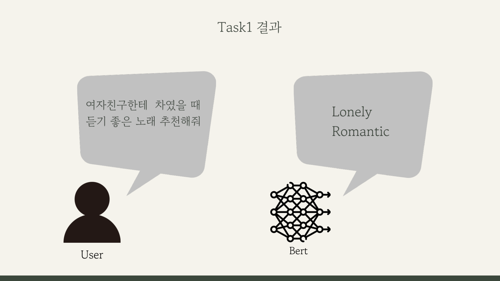
</div>

**The problem:** there was no dataset of *"things a user would type"* paired with mood labels.
**The fix:** prompt **Gemini** to synthesize realistic, lazy-sounding search prompts together with the
moods they imply — producing a `(text, mood)` training set.

<div align="center">
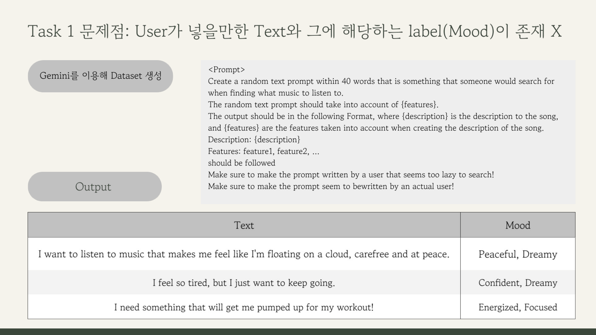
</div>

**The model** ([`notebooks/05_bert_text_to_mood.ipynb`](notebooks/05_bert_text_to_mood.ipynb)):

- Backbone: **`bert-base-uncased`** (HuggingFace Transformers)
- Head: `Dropout(0.3) → Linear(768 → 15)` — **multi-label** output (a song can be both *Sad* and *Romantic*)
- Loss: `BCEWithLogitsLoss` · Optimizer: `Adam (lr 1e-5)` · `MAX_LEN=200`, batch 8, 50 epochs
- Output: a 15-dim **mood probability vector** (sigmoid per label)

```python
class BERTClass(torch.nn.Module):
    def __init__(self):
        super().__init__()
        self.l1 = transformers.BertModel.from_pretrained('bert-base-uncased')
        self.l2 = torch.nn.Dropout(0.3)
        self.l3 = torch.nn.Linear(768, 15)      # 15 moods, multi-label

    def forward(self, ids, mask, token_type_ids):
        _, pooled = self.l1(ids, attention_mask=mask,
                            token_type_ids=token_type_ids, return_dict=False)
        return self.l3(self.l2(pooled))
```

**Result:** *"여자친구한테 차였을 때 들기 좋은 노래 추천해줘"* → **`Lonely, Romantic`** ✅

<div align="center">
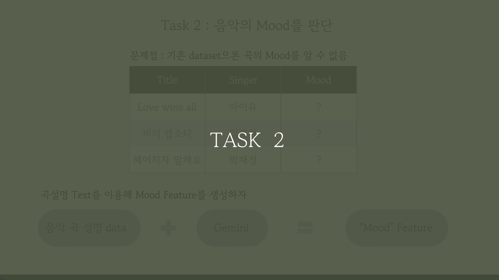
</div>

---

## 🎼 Task 2 — Song → Mood (Gemini labeling)

**Goal:** give every song in the library a mood vector, so it can be matched against the user's.

**The problem:** the raw metadata (`title`, `singer`) tells us nothing about a song's *mood*.
**The fix:** feed each song's **text description** to **Gemini** and ask it to emit a **0/1 flag per mood**.

<div align="center">
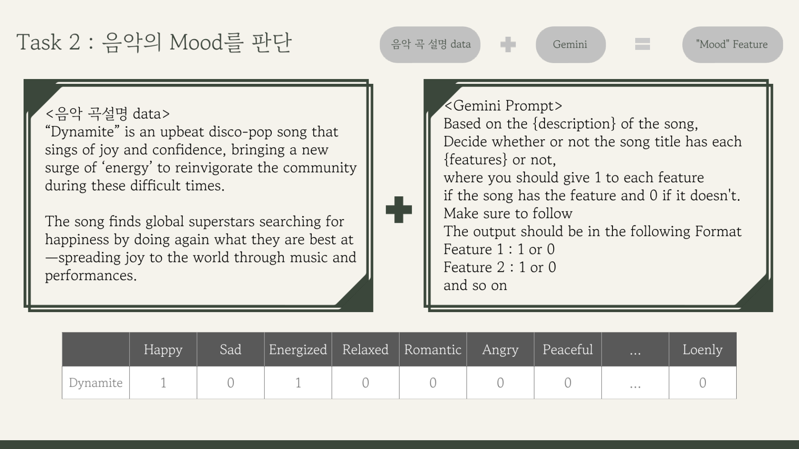
</div>

For example, the description of *"Dynamite"* (an upbeat disco-pop song about joy and energy) yields
`Happy = 1, Energized = 1`, everything else `0`. Running this over the library produces a clean
**song → mood** table:

<div align="center">
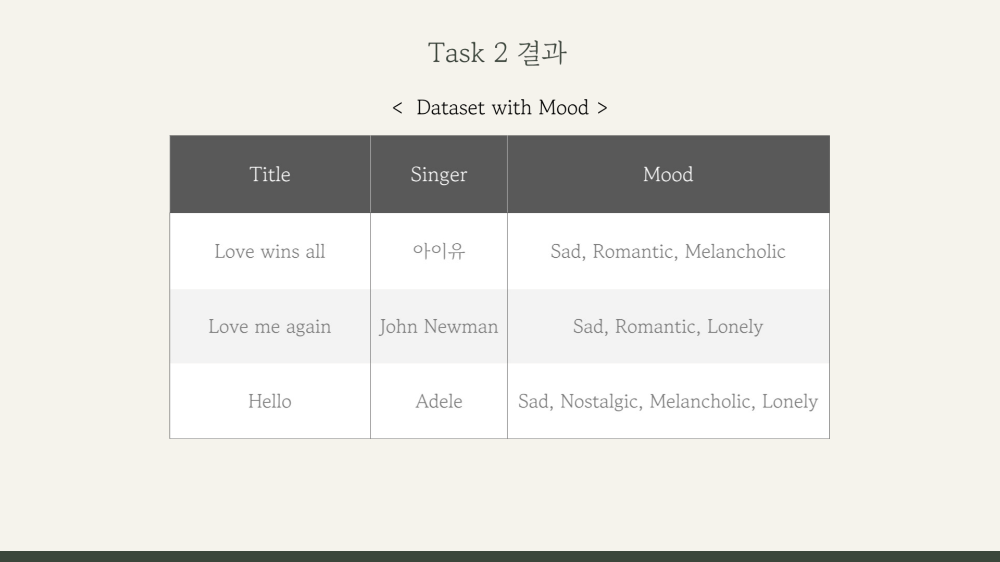
</div>

| Title | Singer | Mood |
|---|---|---|
| Love wins all | IU (아이유) | Sad, Romantic, Melancholic |
| Love me again | John Newman | Sad, Romantic, Lonely |
| Hello | Adele | Sad, Nostalgic, Melancholic, Lonely |

These labels are the supervision signal for Task 3 and the values in the final **feature database**.
They live in [`data/mood_labels/song_mood_15features.csv`](data/mood_labels/song_mood_15features.csv).

---

## 🔊 Task 3 — Audio → Representation (JukeMIR)

**Goal:** learn each song's mood **from the audio itself**, not just its description — because hand- or
LLM-labeling every song doesn't scale and ignores the actual *sound*.

<div align="center">
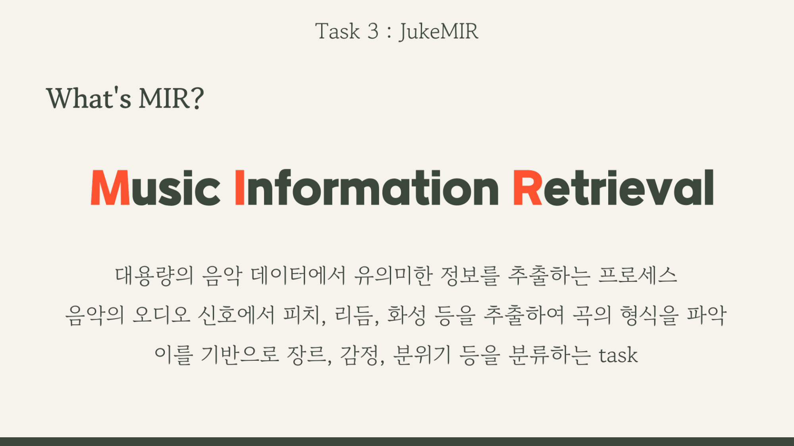
</div>

We use **JukeMIR** — representations from **OpenAI's Jukebox** (a `VQ-VAE + Transformer` music model)
repurposed for **Music Information Retrieval**. The pretrained Jukebox encodes raw audio into a rich
latent that turns out to be excellent for downstream MIR tasks (genre / emotion classification).

<div align="center">
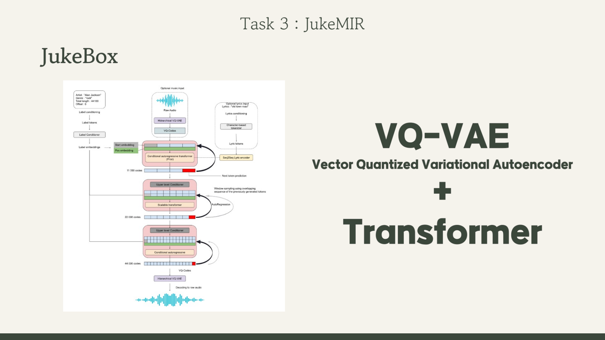
</div>

**How Jukebox encodes audio (the part we reuse):**
1. **Metadata conditioning** — artist/genre/length labels → label embeddings
2. **Audio encoding** — raw audio → *Hierarchical VQ-VAE* → discrete **VQ-codes** (codebook)
3. **Transformer** — autoregressive transformer over the VQ-codes captures temporal structure
4. *(Generation only)* sampling + VQ-VAE decoding back to audio — **we stop at the representation**

<div align="center">
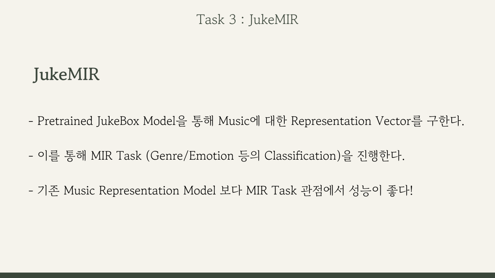
</div>

### Our audio pipeline

<div align="center">
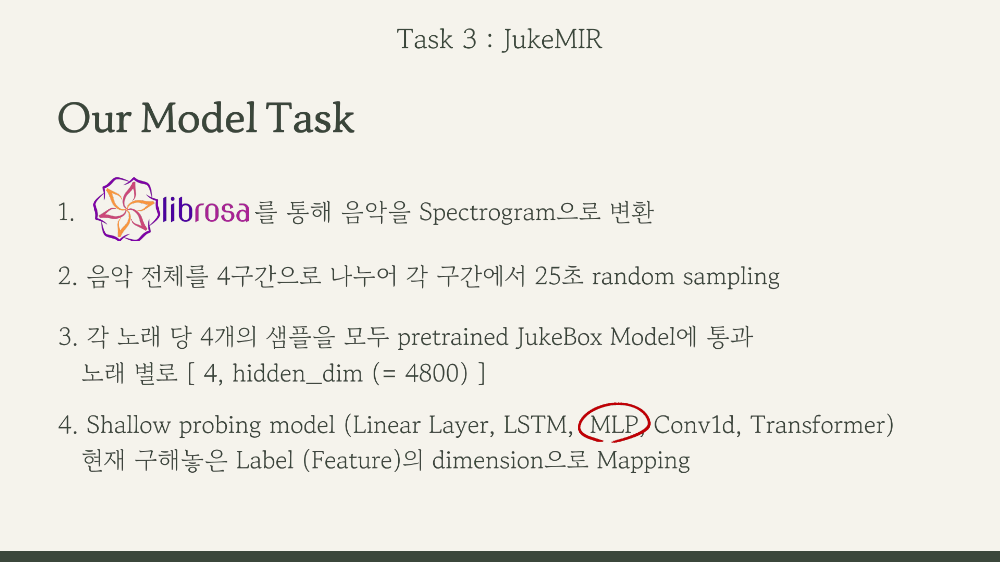
</div>

Songs have different lengths, so we standardize each one before feeding Jukebox
([`notebooks/06_jukemir_embeddings.ipynb`](notebooks/06_jukemir_embeddings.ipynb); extraction script
[`src/representation.py`](src/representation.py), setup in [`src/SETUP_JUKEMIR.md`](src/SETUP_JUKEMIR.md)):

1. Convert audio to a spectrogram with **librosa**
2. Split each song into **4 equal segments** and take a **random ~25 s crop** from each
   (`SAMPLE_LENGTH = 1,048,576` samples ≈ 23.77 s at 44.1 kHz) — *Cropping Method 2*
3. Pass all 4 crops through **pretrained Jukebox** → per-song tensor **`[4, 4800]`**
   (`AVERAGE_SLICES = 64` local average pooling)
4. A **shallow probing model** maps the 4800-dim representation to the 15 mood labels

<div align="center">
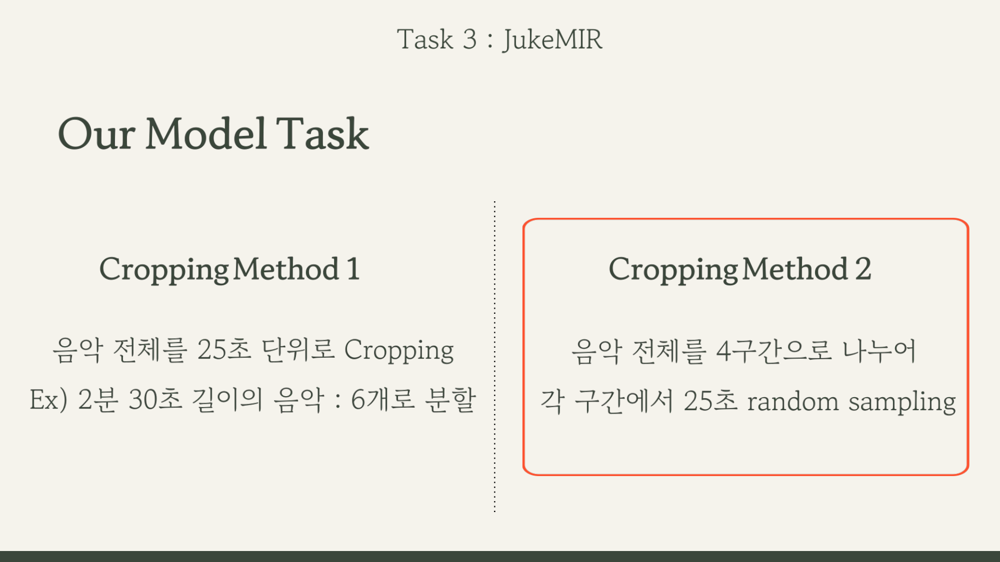
</div>

### Probing model — representation → mood

[`notebooks/07_audio_mood_classifier.ipynb`](notebooks/07_audio_mood_classifier.ipynb) trains a light
classifier (the project explored **Linear / LSTM / MLP / Conv1d / Transformer** heads) on top of the
frozen Jukebox features, supervised by the Task-2 mood labels:

```python
class LSTMClassifier(nn.Module):
    def __init__(self, input_dim, hidden_dim, num_layers, num_classes):
        super().__init__()
        self.lstm = nn.LSTM(input_dim, hidden_dim, num_layers, batch_first=True)
        self.fc   = nn.Linear(hidden_dim, num_classes)   # → 15 moods
    ...
```

- 80 / 20 train-test split · `CrossEntropyLoss` · `Adam (lr 0.05)` · 100 epochs
- Evaluated with **top-k** mood retrieval against the multi-hot ground truth

<div align="center">
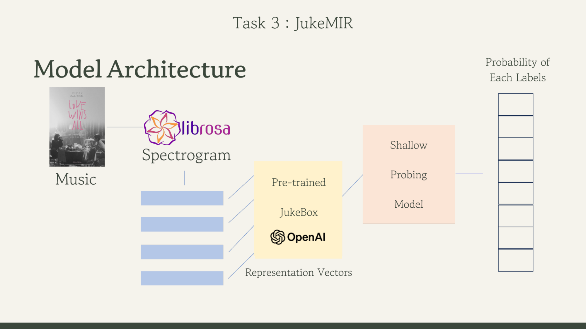
</div>

The output is a **feature database**: every song → a mood vector, derived from its audio.

---

## 🧩 Putting It Together — Recommendation

<div align="center">
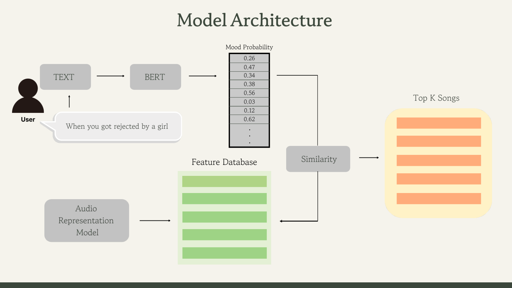
</div>

At inference time:

1. **User text** → BERT (Task 1) → **mood probability vector**
2. **Feature database** holds every song's **mood vector** (Tasks 2 & 3)
3. Compute **similarity** between the user vector and every song vector
4. Return the **Top-K** most similar songs as the playlist

---

## 🏆 Results

Three real queries and the playlists the system returned:

<table>
<tr>
<td width="33%" valign="top">

**"When you got rejected by a girl"**

1. Double take — Dhruv
2. Love me again — John Newman
3. All of me — John Legend
4. I Choose You — UGK
5. Senorita — Shawn Mendes & Camila Cabello

</td>
<td width="33%" valign="top">

**"When you want to go to sleep"**

1. Ditto — NewJeans
2. Eleven — Khalid
3. Perfect Symphony — Ed Sheeran & Andrea Bocelli
4. Warm on a Christmas Night — HONNE

</td>
<td width="33%" valign="top">

**"I need to get motivated to exercise"**

1. 305 to My City — Drake
2. Counting Stars — OneRepublic
3. Sleep Well Beast — The National
4. Sprinter — Dave & Central Cee
5. Goodnight n Go — Ariana Grande

</td>
</tr>
</table>

<div align="center">
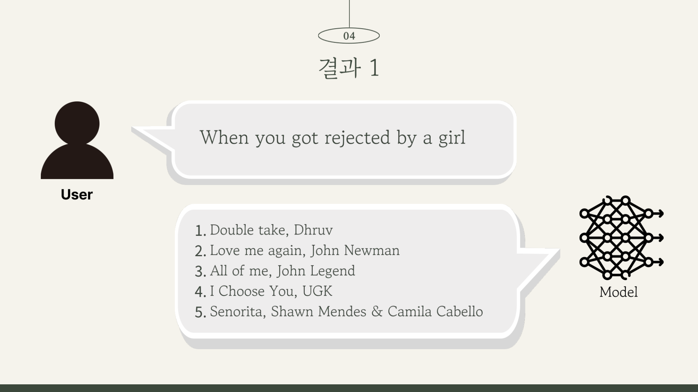
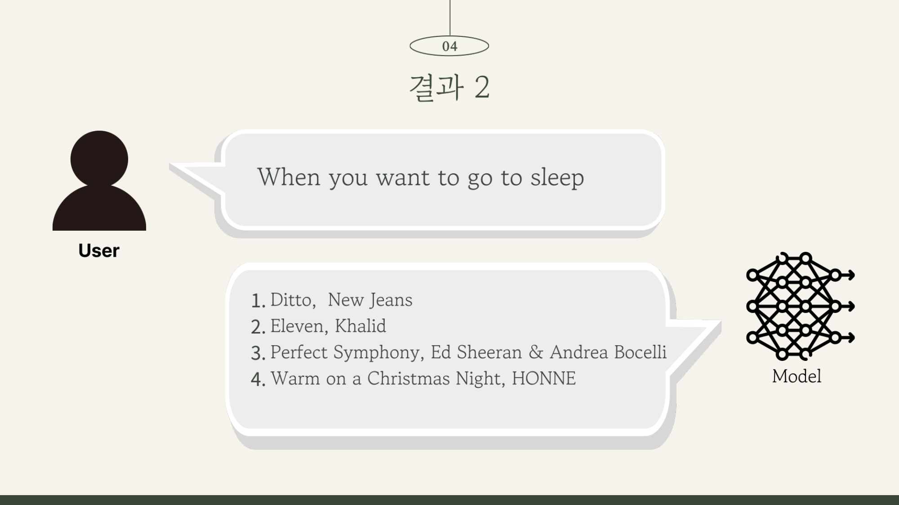
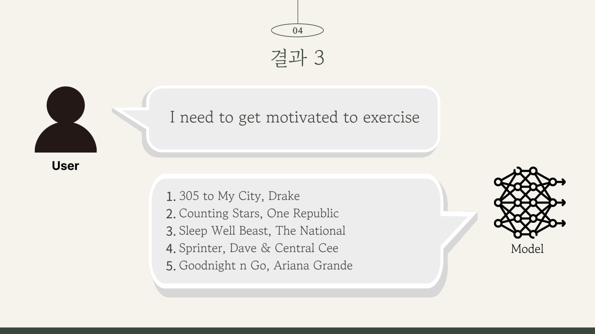
</div>

---

## 🗂 Repository Structure

```
RecSys_Final/
├── README.md                      ← you are here
├── LICENSE                        ← MIT
├── requirements.txt               ← core Python dependencies
├── requirements-jukemir.txt       ← pinned deps for the JukeMIR/Jukebox env (Task 3)
├── .gitignore                     ← excludes model weights / audio / large dumps
├── .github/workflows/pages.yml    ← auto-deploys docs/ to GitHub Pages
│
├── presentation/
│   └── DSL_Recsys.pdf             ← original project presentation (the basis of this work)
│
├── notebooks/                     ← the pipeline, in order
│   ├── 01_genre_aggregation.ipynb        (orig: original_crawling/aggregation.ipynb)
│   ├── 02_youtube_url_crawling.ipynb     (orig: urlcrawling.ipynb)
│   ├── 03_audio_download.ipynb           (orig: musicdownload.ipynb)
│   ├── 03b_audio_download_single.ipynb   (orig: Audio Crawling.ipynb)
│   ├── 04_audio_sampling.ipynb           (orig: audiosampling.ipynb)
│   ├── 05_bert_text_to_mood.ipynb        (orig: BERT/BERT_Fine_Tuning.ipynb)   ← Task 1
│   ├── 06_jukemir_embeddings.ipynb       (orig: JukeMIR/JukeMIR_Embeddings.ipynb) ← Task 3 features
│   └── 07_audio_mood_classifier.ipynb    (orig: totalMIR.ipynb)                ← Task 3 probe
│
├── scripts/
│   └── recommend_demo.py          ← runnable example: text → mood → Top-K (no weights/GPU)
│
├── src/
│   ├── representation.py          ← JukeMIR feature-extraction script (audio → [4, 4800])
│   └── SETUP_JUKEMIR.md           ← how to install Jukebox + download weights (NOT vendored here)
│
├── data/                          ← small CSVs only (see data/README.md for the data dictionary)
│   ├── README.md
│   ├── metadata/                  ← song list, YouTube URLs, per-genre Melon charts
│   └── mood_labels/               ← song descriptions + Gemini-generated song↔mood (15) labels
│
└── docs/                          ← GitHub Pages website
    ├── index.html
    ├── style.css
    └── assets/                    ← architecture.svg + key slides from the presentation
```

> **What's intentionally *not* here:** trained weights (BERT `.pth`, audio probe `.pth`), the 10 GB
> Jukebox prior, the 2,075 raw `.wav` files, and precomputed feature dumps. The repo is meant to
> **explain and let you reproduce** the project — see the [reproduction steps](#-getting-started) and
> [Large Files](#-large-files-weights--data) below.

---

## 🚀 Getting Started

> ⚠️ The notebooks were written for **Google Colab** (they `mount` Google Drive and use absolute
> `/content/drive/...` paths). To run them locally, replace those paths with paths under this repo.

### 1. Clone & install

```bash
git clone <your-fork-url> RecSys_Final
cd RecSys_Final
python -m venv .venv && source .venv/bin/activate
pip install -r requirements.txt
```

### 2. Set up JukeMIR (for audio features — Task 3)

Jukebox is **not** vendored here (large third-party package with pinned, conflicting deps). Install it
from upstream into a **separate environment** and download its pretrained weights — full steps in
[`src/SETUP_JUKEMIR.md`](src/SETUP_JUKEMIR.md).

### 3. Reproduce the pipeline

| Order | Notebook | What it does |
|---|---|---|
| 1 | `01_genre_aggregation` | Build the song list from Melon genre charts |
| 2 | `02_youtube_url_crawling` | Resolve a YouTube URL per song (Selenium) |
| 3 | `03_audio_download` | Download `.wav` audio (yt-dlp) |
| 4 | `04_audio_sampling` | Sample / validate clips |
| 5 | `05_bert_text_to_mood` | **Task 1** — fine-tune BERT for text → mood |
| 6 | `06_jukemir_embeddings` | **Task 3a** — extract `[4, 4800]` Jukebox features per song |
| 7 | `07_audio_mood_classifier` | **Task 3b** — train the probe (features → 15 moods) |

### 4. Publish the website (optional)

This repo ships a ready-to-serve site in [`docs/`](docs/) **and** an auto-deploy workflow
([`.github/workflows/pages.yml`](.github/workflows/pages.yml)). To publish with **GitHub Pages**:

1. Push this folder to a GitHub repository (as the repo root).
2. **Settings → Pages → Build and deployment → Source: _GitHub Actions_.**
3. That's it — every push to `main` rebuilds and deploys the site automatically
   (or trigger it manually from the **Actions** tab → *Deploy GitHub Pages* → *Run workflow*).
4. Your site goes live at `https://<user>.github.io/<repo>/`.

> Prefer no Actions? You can instead choose **Source: _Deploy from a branch_** → `main` / `/docs`.

To preview locally: `python3 -m http.server 8099 --directory docs` → open <http://localhost:8099>.

---

## 📦 Large Files (weights & data)

This repo deliberately ships **no model weights and no raw audio** — none are needed to read and
understand the project. You only need the files below if you want to **re-run** a stage; every one can
be regenerated from the notebooks or downloaded. (They're also excluded by [`.gitignore`](.gitignore)
so the repo stays lightweight and pushable.)

| File (original location) | Size | What it is | How to get it |
|---|---|---|---|
| `vqvae.pth.tar` | ~7.7 MB | Jukebox VQ-VAE weights | `wget https://openaipublic.azureedge.net/jukebox/models/5b/vqvae.pth.tar` |
| `prior_level_2.pth.tar` | ~10 GB | Jukebox prior (5b) weights | `wget https://openaipublic.azureedge.net/jukebox/models/5b/prior_level_2.pth.tar` |
| `BERT_model_parameters.pth` | ~438 MB | Fine-tuned BERT (Task 1) | re-run `notebooks/05_bert_text_to_mood.ipynb` |
| `total_model1.pth` | ~1.4 GB | Audio mood probe (Task 3) | re-run `notebooks/07_audio_mood_classifier.ipynb` |
| `*.pkl` in `datasets/MIR/` | up to ~380 MB | precomputed Jukebox features / labels | re-run `notebooks/06` & `07` |
| `*.wav` (2,075 songs) | large | crawled audio | re-run `notebooks/01–03` |

> The original raw project (with all weights, audio and feature dumps) remains intact in the parent
> `RecSys/` folder; this `RecSys_Final/` folder is the shareable, documented subset.

---

## 🧭 Limitations & Future Work

<div align="center">
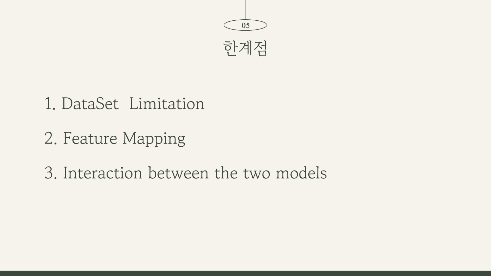
</div>

1. **Dataset limitation** — mood labels are LLM-generated (no human ground truth), and the audio
   library is bounded by Melon Top-100 charts.
2. **Feature mapping** — collapsing rich audio representations and text into the same 15-mood space
   loses nuance; the mapping from Jukebox features to moods is the weakest link.
3. **Interaction between the two models** — the text branch (BERT) and the audio branch (JukeMIR) are
   trained independently and only meet at the similarity step; jointly aligning them is future work.

---

## 🛠 Tech Stack

**Language/ML:** Python · PyTorch · HuggingFace Transformers (BERT) · scikit-learn
**Audio:** OpenAI Jukebox / JukeMIR · librosa
**LLM labeling:** Google Gemini
**Data collection:** Selenium · BeautifulSoup · yt-dlp · Melon & YouTube
**Environment:** Google Colab (GPU)

---

## 📄 License

Released under the [MIT License](LICENSE). Note that the third-party **Jukebox / simplified-jukemir**
code and OpenAI's pretrained weights carry their own licenses and are not redistributed here.

---

## 👥 Team

**DSL 24-1 Modeling Project — "Music Playlist"**

- 김영호 (10기)
- 박태정 (10기)
- 신재우 (10기)
- 권구희 (11기)

---

<div align="center">

📑 Full presentation: [`presentation/DSL_Recsys.pdf`](presentation/DSL_Recsys.pdf) ·
🌐 Web version: [`docs/index.html`](docs/index.html)

</div>
