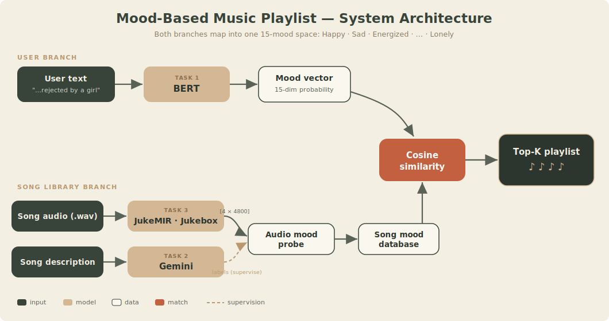

<div align="center">

# 🎵 Music Playlist — Mood-Based Music Recommendation

**DSL 24-1 Modeling Project**

*Tell us how you feel, in your own words — get a playlist that matches the mood.*

🌐 **[Live site](https://jaewoo356.github.io/RecSys_DSL/)**  ·  📑 **[Slides (PDF)](presentation/DSL_Recsys.pdf)**

[](https://github.com/jaewoo356/RecSys_DSL/actions/workflows/ci.yml)

</div>

<div align="center">

</div>

---

## Overview

Type a situation — *"when you got rejected by a girl"*, *"I need to get motivated to exercise"* — and the
system returns songs whose **mood** matches. The idea: a song's tempo and register define its genre, and
its genre is essentially its **mood**. If we can read mood from the user's text *and* know each song's mood,
a **similarity match** yields a mood-aligned playlist.

Three ML tasks solve the two halves of that match:

| | Task | Input → Output | Model |
|---|---|---|---|
| **1** | Read the user's mood | text → mood vector | **BERT** (fine-tuned, multi-label) |
| **2** | Label each song's mood | description → mood vector | **Gemini** (LLM annotation) |
| **3** | Mood from the audio | audio → representation → mood | **JukeMIR** (OpenAI Jukebox + probe) |

Both branches map into one **15-mood space**: `Happy · Sad · Energized · Relaxed · Nostalgic · Romantic ·
Angry · Focused · Inspired · Melancholic · Peaceful · Anxious · Confident · Dreamy · Lonely`.

> See the **[live site](https://jaewoo356.github.io/RecSys_DSL/)** or the **[slides](presentation/DSL_Recsys.pdf)**
> for the full visual walkthrough.

---

## ⚡ Try it (no weights, no GPU)

The final step — mood vector → cosine similarity → Top-K — runs on the **real 1,142-song database** with
just `pandas` + `numpy`:

```bash
pip install -e ".[dev]"     # or just: pip install pandas numpy
make demo                    # python scripts/recommend_demo.py  (-q "..." -k N)
make eval                    # reproducible metrics + baselines  (see Evaluation)
make test                    # 12 unit tests
```

The only mock is text→mood (the real project uses fine-tuned BERT); the cosine ranking is the real thing,
and lives in the importable [`recsys/`](recsys/) package.

---

## The three tasks

**Task 1 — Text → Mood (BERT).** No dataset of *(user text, mood)* existed, so we prompted **Gemini** to
synthesize realistic search prompts with their moods, then fine-tuned `bert-base-uncased` as a 15-label
multi-label classifier. → [`notebooks/05_bert_text_to_mood.ipynb`](notebooks/05_bert_text_to_mood.ipynb)

**Task 2 — Song → Mood (Gemini).** Title/artist say nothing about mood, so we feed each song's **text
description** to Gemini for a 0/1 flag per mood (e.g. *"Dynamite"* → Happy, Energized). These become the
song mood database. → [`data/mood_labels/`](data/mood_labels/)

**Task 3 — Audio → Representation (JukeMIR).** To read mood from sound, we extract features from **OpenAI's
Jukebox** (VQ-VAE + Transformer): librosa spectrogram → 4 random ~25 s crops → Jukebox → a `[4, 4800]`
vector per song → a shallow probe maps it to the 15 moods.
→ [`notebooks/06`](notebooks/06_jukemir_embeddings.ipynb), [`07`](notebooks/07_audio_mood_classifier.ipynb),
[`src/SETUP_JUKEMIR.md`](src/SETUP_JUKEMIR.md)

At inference: **user text → BERT → mood vector**, then **cosine similarity** against the song mood database
→ **Top-K playlist**.

---

## Dataset

**2,075 songs across 12 genres**, crawled from Melon's genre Top-100 charts → YouTube audio (`.wav`); mood
labels generated with Gemini. The small CSVs live in [`data/`](data/) — see the
[data dictionary](data/README.md). Raw audio and large feature dumps are not shipped (regenerate via the
notebooks).

---

## Results

| Query | Sample recommendations |
|---|---|
| *"When you got rejected by a girl"* | Love me again — John Newman · All of me — John Legend |
| *"When you want to go to sleep"* | Ditto — NewJeans · Perfect Symphony — Ed Sheeran & Andrea Bocelli |
| *"I need to get motivated to exercise"* | Counting Stars — OneRepublic · Sprinter — Dave & Central Cee |

---

## Evaluation

`make eval` (or `python scripts/evaluate.py`) runs a **seeded, reproducible** evaluation on the 1,142
labeled songs, scoring the cosine recommender against **random** and **popularity** baselines:

| Protocol | metric | cosine | popularity | random |
|---|---:|---:|---:|---:|
| **Genre retrieval** — *non-circular: relevance = same Melon genre, a label the system never sees* | P@5 | **0.117** | 0.102 | 0.107 |
| **Mood overlap** (leave-one-out, ≥2 shared moods) | nDCG@10 | **1.000** | 0.960 | 0.520 |

**Read honestly:** within the mood space the recommender is internally consistent and clears the
baselines — but on an *independent* signal (genre) it sits **barely above chance**, i.e. it matches
*mood*, not genre. There's no human-judged ground truth for "the right playlist," so that's the ceiling
of what's measurable here. Data quality also limits it: **934 / 2,076 songs (45%) are unlabeled**, labels
are LLM-generated with no human validation, and they skew to a few moods.

> ⚠️ The original training notebooks have real bugs (e.g. the BERT eval loop `break`s before computing
> any metric; the audio probe uses the wrong loss; the split is unseeded). They're documented with
> drop-in fixes in **[`KNOWN_ISSUES.md`](KNOWN_ISSUES.md)**. The clean code in [`recsys/`](recsys/) (seeded,
> tested, repo-root paths) is what the demo and evaluator use.

---

## Repository structure

```
├── README.md · LICENSE · KNOWN_ISSUES.md · Makefile · pyproject.toml
├── requirements.txt · requirements-jukemir.txt
├── recsys/         the package: data · recommend · metrics · eval · seed · config
├── scripts/        recommend_demo.py · evaluate.py      ← runnable, no weights
├── tests/          pytest suite (metrics, recommender, eval)
├── notebooks/      01–07                                 ← the pipeline, in order
├── src/            representation.py + SETUP_JUKEMIR.md
├── data/           metadata/ + mood_labels/              ← small CSVs + data dictionary
├── presentation/   DSL_Recsys.pdf                        ← the source presentation
├── docs/           the GitHub Pages site (+ architecture.svg, slides)
└── .github/        workflows: ci.yml (tests) · pages.yml (site)
```

---

## Reproduce it

```bash
pip install -r requirements.txt
```

Run the notebooks in order (`01`–`07`). For the audio branch (Task 3), set up Jukebox in a **separate
environment** — see [`src/SETUP_JUKEMIR.md`](src/SETUP_JUKEMIR.md).

> **No model weights or raw audio are shipped** — none are needed to read the project; you only need them
> to re-run a stage, and each can be regenerated or downloaded (Jukebox weights, BERT/probe checkpoints).
> The notebooks were written for **Google Colab** (Drive mounts, `/content/...` paths) — adjust paths to
> run locally.

---

## Limitations

Mood labels are LLM-generated (no human ground truth) and cover only 55% of songs; the audio library is
bounded by Melon Top-100; the text and audio branches are trained independently, meeting only at the
similarity step; and on an independent signal the recommender is barely above chance (see
[Evaluation](#evaluation)). Training-code bugs and fixes are catalogued in
[`KNOWN_ISSUES.md`](KNOWN_ISSUES.md).

---

## Stack & team

**Stack:** PyTorch · HuggingFace BERT · OpenAI Jukebox / JukeMIR · Gemini · librosa · Selenium / yt-dlp

**Team — DSL 24-1:** 김영호 · 박태정 · 신재우 *(10기)* · 권구희 *(11기)*

Released under the [MIT License](LICENSE).
